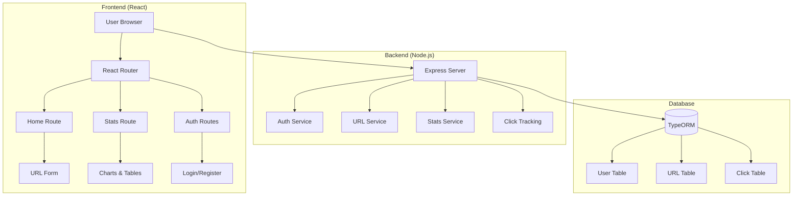
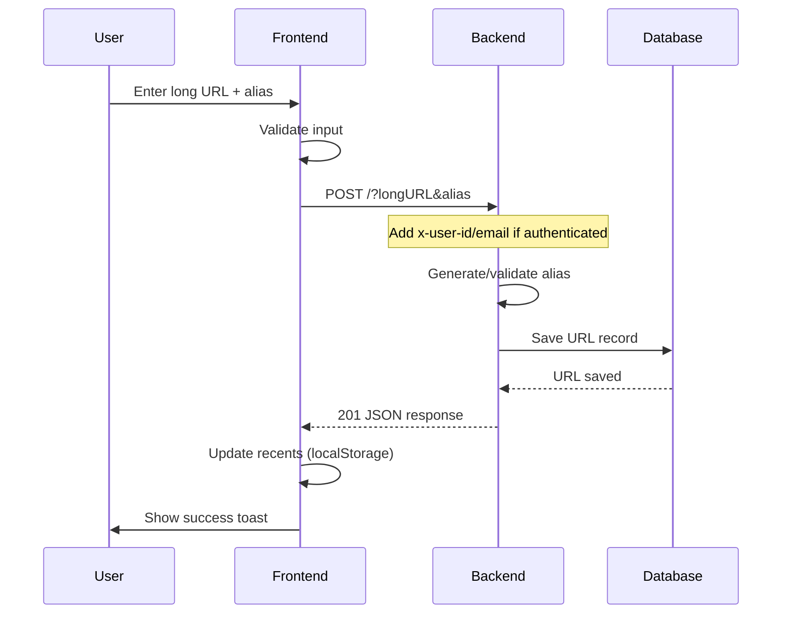
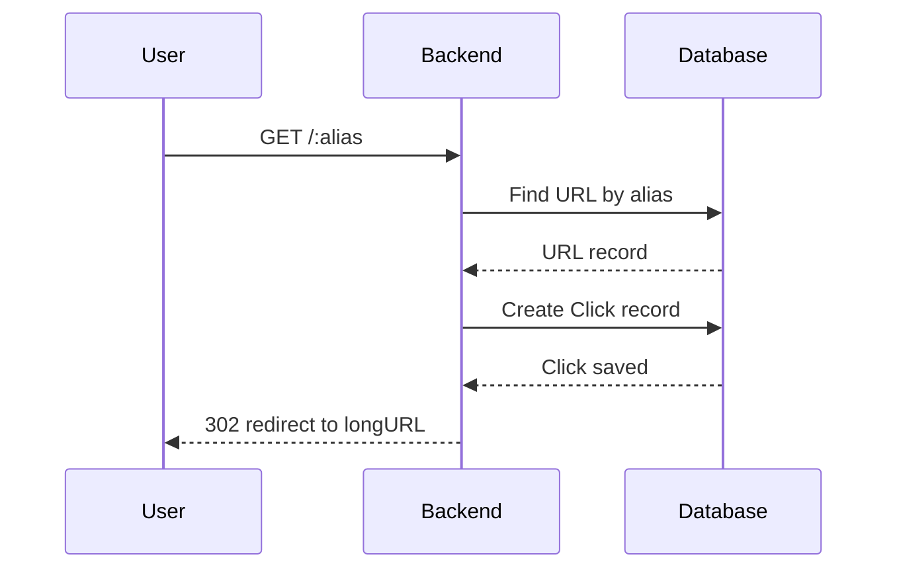
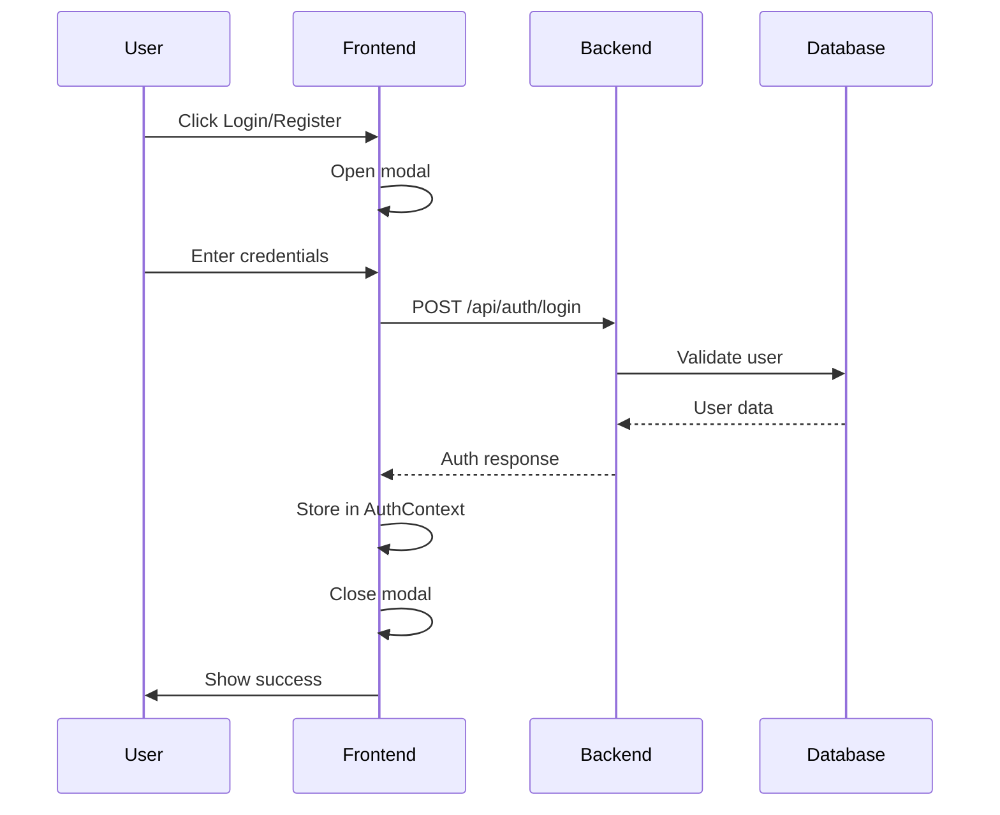
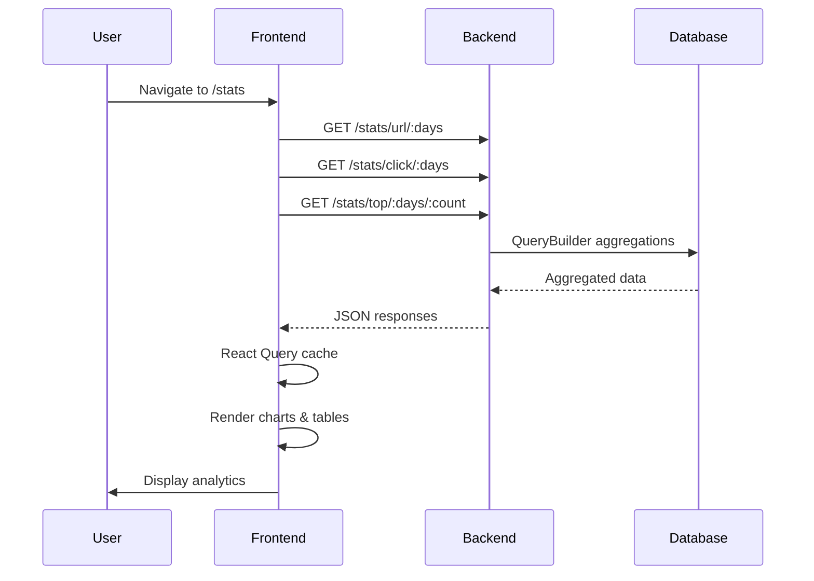
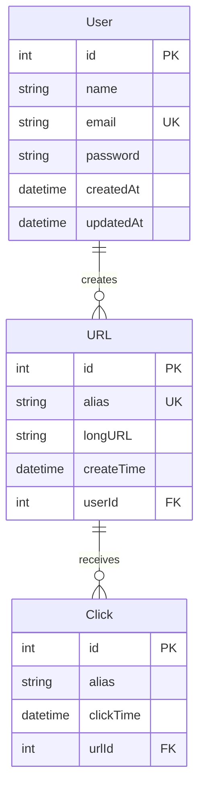

# Short-URL 🔗

A modern, production-ready URL shortening service built with React, Node.js, and TypeORM. Features real-time analytics, user authentication, and a beautiful dashboard.

## 🏗️ Architecture Overview



## 🔄 Request Flow Diagrams

### 1. Create Short URL Flow



### 2. URL Redirect Flow



### 3. Authentication Flow



### 4. Analytics & Stats Flow



## 🛠️ Tech Stack

### Frontend

-   **Framework**: React 18 + React Router
-   **Build Tool**: Vite
-   **State Management**: React Query + Context API
-   **UI Components**: Shadcn/ui + Tailwind CSS
-   **Charts**: Recharts
-   **Forms**: React Hook Form + Zod validation

### Backend

-   **Runtime**: Node.js + Express
-   **Database**: TypeORM with MySQL/PostgreSQL
-   **Authentication**: JWT-based with password hashing
-   **Validation**: class-validator
-   **Scheduling**: node-cron for data seeding

### Database Schema



## 🚀 Getting Started

### Prerequisites

-   Node.js 18+
-   MySQL/PostgreSQL
-   npm or yarn

### Installation

1. **Clone the repository**

    ```bash
    git clone <your-repo-url>
    cd short-url
    ```

2. **Install dependencies**

    ```bash
    # Frontend
    cd _frontend
    npm install

    # Backend
    cd ../backend
    npm install
    ```

3. **Environment Setup**

    ```bash
    # Backend .env
    DB_HOST=localhost
    DB_PORT=3306
    DB_USERNAME=root
    DB_PASSWORD=password
    DB_DATABASE=shorturl
    PORT=3000
    ```

4. **Database Setup**

    ```bash
    # Create database
    CREATE DATABASE shorturl;

    # Run migrations (TypeORM will auto-create tables)
    npm run start
    ```

5. **Start Development**

    ```bash
    # Backend (Terminal 1)
    cd backend
    npm run dev

    # Frontend (Terminal 2)
    cd _frontend
    npm run dev
    ```

## 📊 API Endpoints

### URL Management

-   `POST /` - Create short URL
-   `GET /:alias` - Redirect to long URL

### Analytics

-   `GET /stats/url/:days` - URL creation stats
-   `GET /stats/click/:days` - Click statistics
-   `GET /stats/top/:days/:count` - Top performing URLs

### Authentication

-   `POST /api/auth/register` - User registration
-   `POST /api/auth/login` - User login

### Development

-   `POST /faker` - Generate sample data

## 🎯 Key Features

### 🔐 User Authentication

-   Secure registration and login
-   Password hashing with bcrypt
-   JWT-based session management
-   Protected routes and API calls

### 🔗 URL Shortening

-   Custom alias support
-   Automatic alias generation
-   Click tracking and analytics
-   Recent URLs in localStorage

### 📈 Analytics Dashboard

-   Real-time click statistics
-   URL creation trends
-   Top performing URLs
-   Time-based filtering (7, 30, 90 days)

### 🎨 Modern UI/UX

-   Responsive design
-   Dark/light theme support
-   Smooth animations
-   Mobile-first approach

## 🚢 Deployment

### Docker

```bash
# Build image
docker build -t short-url .

# Run container
docker run -p 3000:3000 short-url
```

### Kubernetes

```bash
kubectl apply -f deployment.yaml
```

### Environment Variables

```bash
NODE_ENV=production
DB_HOST=your-db-host
DB_PASSWORD=your-db-password
JWT_SECRET=your-jwt-secret
```

## 🔧 Development

### Project Structure

```
short-url/
├── _frontend/          # React frontend
│   ├── app/
│   │   ├── components/ # UI components
│   │   ├── contexts/   # React contexts
│   │   ├── routes/     # Page routes
│   │   └── api/        # API client
│   ├── build/          # Production build
│   └── package.json
├── backend/            # Node.js backend
│   ├── src/
│   │   ├── entity/     # TypeORM entities
│   │   ├── services/   # Business logic
│   │   └── routes/     # API routes
│   └── package.json
└── README.md
```

### Available Scripts

#### Frontend

```bash
npm run dev          # Start dev server
npm run build        # Build for production
npm run preview      # Preview production build
```

#### Backend

```bash
npm run dev          # Start with nodemon
npm run start        # Start production server
npm run build        # Build TypeScript
```

## 📝 Contributing

1. Fork the repository
2. Create a feature branch (`git checkout -b feature/amazing-feature`)
3. Commit your changes (`git commit -m 'Add amazing feature'`)
4. Push to the branch (`git push origin feature/amazing-feature`)
5. Open a Pull Request

## 📄 License

This project is licensed under the MIT License - see the [LICENSE](LICENSE) file for details.

## 🤝 Support

-   **Issues**: [GitHub Issues](https://github.com/yourusername/short-url/issues)
-   **Discussions**: [GitHub Discussions](https://github.com/yourusername/short-url/discussions)
-   **Email**: your-email@example.com

---

Built with ❤️ using modern web technologies
